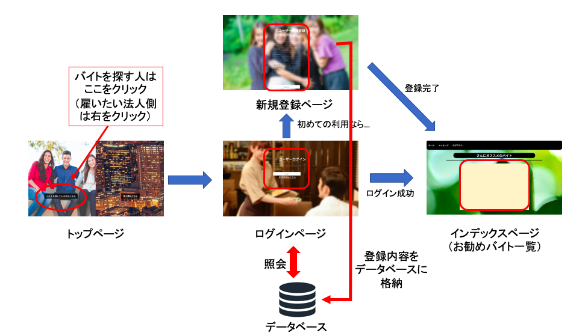

# バイト探しアプリ (2020/11/03 開発途中)

## 概要
データベースを使ったウェブアプリの勉強をするため，バイト探しアプリを制作しています．
コンセプトは，自分に合うバイトを探している学生などのユーザーと，バイトを雇いたい雇用者をつなぐプラットフォームです．

実装には以下の言語を使用しています．
- バックエンド: Python(Flask)
- フロントエンド: HTML, CSS
- データベース: SQLite3

## アプリのシステム図

  

主なページは上図に表される４つのページです．以下，それぞれのページで行われる処理詳細です．

### トップページ
このアプリのトップページです．バイトを探している人は画面左側のボタンを，企業など雇い主となる法人は左側のボタンを押すことで，それぞれログインページにとぶことができます．

### ログインページ
マイページにアクセスするためのログインページです．ユーザー名とパスワードを入力し，データベースに照会して一致するアカウントが存在すれば自分のマイページに遷移することができます．間違ったパスワードや存在しないユーザー名を入力した場合，ログイン失敗となりマイページへはいけないようになっています．

### 新規登録ページ
初めて利用するユーザーがアカウントを作るためのページです．ユーザーネームやメールアドレス，パスワードの他，所属や住んでいる地域も登録できます．入力されたパスワードは実際にはハッシュ化されてデータベースに登録されます．登録が完了するとそのまま自分のマイページへ遷移します．

### インデックスページ（開発中）
ユーザーのマイページです．登録された情報から，おすすめのバイトを表示します．
